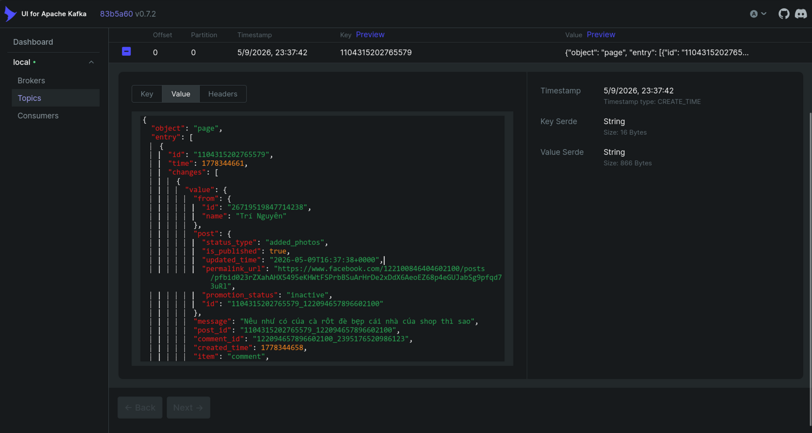
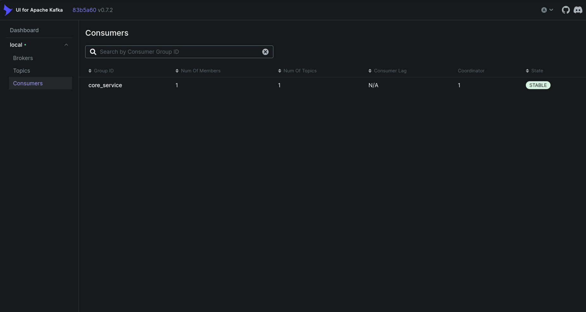
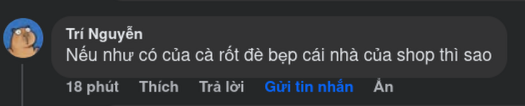
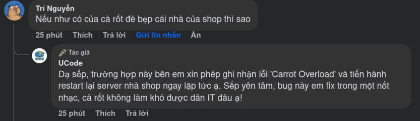

# Thông tin sinh viên:
**SV: Nguyễn Thành Trí - 6451071079**   

# Báo Cáo Luồng Xử Lý Hệ Thống Tự Động Trả Lời Facebook Comment (Facebook AI Webhook)

Hệ thống được thiết kế theo kiến trúc Microservices kết hợp Message Queue (Kafka) nhằm đảm bảo khả năng chịu tải cao, không làm rớt (miss) webhook của Facebook, kết hợp giữa thuật toán Rule-based (Luật lập trình sẵn) và Trí tuệ nhân tạo (Dify AI) để tăng độ linh hoạt và tiết kiệm chi phí.

Dưới đây là luồng xử lý chi tiết từng bước khi có một khách hàng bình luận trên Fanpage:

## Giai đoạn 1: Tiếp nhận dữ liệu (Webhook & Kafka)
1. **Facebook Webhook:** Khi người dùng bình luận vào bài viết, Facebook lập tức gửi một gói dữ liệu (JSON payload) chứa thông tin bình luận tới endpoint của dịch vụ `web-hook` (Django App).
2. **Đẩy vào Kafka:** Để phản hồi HTTP 200 OK ngay lập tức cho Facebook (tránh bị Facebook phạt/khóa Webhook vì timeout), dịch vụ `web-hook` không xử lý logic ngay mà đẩy nguyên gói dữ liệu JSON vào một hàng đợi Kafka có tên là `raw_events`.


## Giai đoạn 2: Trích xuất và Tiền xử lý (Core Service Worker)
3. **Tiêu thụ (Consume):** Container `core-service-worker` liên tục lắng nghe topic `raw_events` từ Kafka và lấy gói dữ liệu ra để xử lý.



4. **Phân tích dữ liệu (Parser):** Hệ thống bóc tách các thông tin quan trọng như `sender_id` (người gửi), `comment_id`, `post_id`, `parent_id` và nội dung `message`.
5. **Lọc bình luận rác/không hợp lệ:**
   - **Chống Loop (Lặp vô hạn):** Nếu `sender_id` trùng với ID của Fanpage (tức là bình luận do chính Page trả lời), hệ thống bỏ qua.
   - **Bỏ qua Comment con (Nested Reply):** Nếu `parent_id` khác với `post_id` (khách hàng đang trả lời một comment khác chứ không phải bình luận thẳng vào bài), hệ thống sẽ bỏ qua.

```python
# Trích xuất từ: consume_raw_events.py
def _process_comment_event(self, evt, payload, fb_client, failed_producer, ai_classifier=None):
    # Chống Loop: bỏ qua comment do chính page gửi
    if getattr(settings, "FACEBOOK_PAGE_ID", "") and str(evt.sender_id) == str(settings.FACEBOOK_PAGE_ID):
        return

    # Bỏ qua Comment con (Nested reply)
    if evt.parent_id and evt.post_id and str(evt.parent_id) != str(evt.post_id):
        return
```


6. **Lưu trữ Database:** Thông tin người dùng (`SocialProfile`) và bình luận (`IncomingEvent`) được lưu vào cơ sở dữ liệu PostgreSQL. Hệ thống sử dụng thuật toán mã hóa SHA-256 tạo ra `content_hash` để tiện cho việc nhận diện nội dung trùng lặp.

## Giai đoạn 3: Đánh giá và Phân loại (Rule + AI)
7. **Rule-based Spam Check (Lọc Spam cấp 1):** 
   - Kiểm tra xem nội dung có chứa link (`http`, `www`) hoặc từ khóa lừa đảo (`kiếm tiền`, `zalo.me`, `telegram`) hay không.
   - Kiểm tra xem người này có đang spam bình luận giống hệt nhau liên tục hay không (dựa vào `content_hash` trong 24h). 
   - Nếu vi phạm, đánh dấu `is_spam = True`.

```python
# Trích xuất từ: rules.py
def classify_rule_based(message: str) -> Classification:
    if _LINK_RE.search(msg):
        return Classification(True, "contains_link", None, None)

    scam_keywords = ["kiếm tiền", "đầu tư", "nhận thưởng", "click", "telegram", "zalo.me"]
    if any(k in norm for k in scam_keywords):
        return Classification(True, "scam_keywords", None, None)
```

8. **Dify AI Classification (Phân tích cấp 2):** 
   - Nếu không phải Spam, nội dung được gửi sang **Dify AI**.
   - AI được cấu hình đóng vai trò một Fanpage Công nghệ thông tin (IT) với tính cách dí dỏm, hài hước.
   - AI sẽ phân tích Ý định (Intent), Thái độ (Sentiment), và sinh ra một câu trả lời (`ai_reply`) mang phong cách lập trình viên.

```python
# Trích xuất từ: ai_classifier.py
query = f"{_SYSTEM_PROMPT}\n\nComment: {message}"
payload = {
    "inputs": {},
    "query": query,
    "response_mode": "blocking",
    "user": "core-service"
}
response = self._requests.post(self._endpoint, json=payload, headers=headers)
```

9. **Cơ chế Fallback (Dự phòng):** Nếu API của AI gặp sự cố (mất mạng, hết tiền), hệ thống sẽ tự động hạ cấp xuống dùng Rule-based để tiếp tục bắt từ khóa và sinh ra câu trả lời dựa trên các Template có sẵn.

## Giai đoạn 4: Thực thi hành động (Facebook Graph API)
10. **Quyết định Hành động:**
    - **Nếu là Spam:** Gọi API Facebook để **Ẩn bình luận (Hide Comment)** ngay lập tức. Nếu spam quá 3 lần/ngày, đưa người dùng vào danh sách đen (Blacklist).
    - **Nếu là bình luận hợp lệ:** Lấy câu trả lời (`ai_reply` hoặc Template dự phòng) và gọi API Facebook để **Trả lời bình luận (Reply to Comment)**.

```python
# Trích xuất từ: consume_raw_events.py
if incoming.is_spam:
    # Ẩn comment spam
    fb_client.hide_comment(evt.comment_id)
else:
    # Ưu tiên AI reply, nếu AI lỗi thì dùng rule-based reply template
    reply = ai_reply or reply_template(incoming.intent)
    if reply:
        fb_client.reply_to_comment(evt.comment_id, reply)
```


11. **Cập nhật Trạng thái:** Cập nhật trạng thái sự kiện trong Database thành `PROCESSED` (đã xử lý), `REPLIED` (đã trả lời) hoặc `REVIEW_PENDING` (chờ duyệt).

## Giai đoạn 5: Cơ chế Retry (Chống lỗi mạng)
12. **Ghi nhận lỗi:** Nếu trong quá trình gọi API Facebook (ẩn hoặc trả lời comment) mà mạng bị lỗi, hệ thống sẽ lưu thông tin hành động bị lỗi vào bảng `FailedAction`.
13. **Thử lại (Retry):** Container `core-service-retry` chạy ngầm sẽ định kỳ quét các `FailedAction` này và tiến hành gọi lại API (tối đa 5 lần) cho đến khi thành công thì thôi, đảm bảo khách hàng chắc chắn nhận được câu trả lời dù có sự cố chập chờn về mạng.
